# 📘 Buku Panduan Penggunaan — CBT Praktikum

**Sistem Computer Based Testing (CBT)** untuk ujian praktikum online.
**Universitas Pelita Bangsa — Laboratorium Informatika**

---

## Daftar Isi

1. [Pendahuluan](#1-pendahuluan)
2. [Persyaratan Sistem](#2-persyaratan-sistem)
3. [Akses dan Login](#3-akses-dan-login)
4. [Dashboard Admin](#4-dashboard-admin)
5. [Manajemen Mata Kuliah](#5-manajemen-mata-kuliah)
6. [Manajemen Modul Praktikum](#6-manajemen-modul-praktikum)
7. [Bank Soal](#7-bank-soal)
8. [Manajemen Kelas](#8-manajemen-kelas)
9. [Manajemen Mahasiswa](#9-manajemen-mahasiswa)
10. [Manajemen Ujian](#10-manajemen-ujian)
11. [Monitoring Ujian](#11-monitoring-ujian)
12. [Hasil dan Laporan](#12-hasil-dan-laporan)
13. [Rekap Nilai per Kelas](#13-rekap-nilai-per-kelas)
14. [PDF Laporan dan Ekspor Data](#14-pdf-laporan-dan-ekspor-data)
15. [Sisi Mahasiswa](#15-sisi-mahasiswa)
16. [Mengerjakan Ujian](#16-mengerjakan-ujian)
17. [Fitur Keamanan Ujian](#17-fitur-keamanan-ujian)
18. [Impor Data](#18-impor-data)
19. [Panduan Singkat (Quick Start)](#19-panduan-singkat-quick-start)
20. [Pemecahan Masalah](#20-pemecahan-masalah)

---

## 1. Pendahuluan

CBT Praktikum adalah platform ujian berbasis komputer (Computer Based Testing) yang dikembangkan untuk mendukung pelaksanaan ujian praktikum di Laboratorium Informatika Universitas Pelita Bangsa.

### Fitur Utama

| Fitur | Deskripsi |
|-------|-----------|
| **Manajemen Mata Kuliah** | Tambah, edit, hapus mata kuliah |
| **Manajemen Modul** | Kelola modul praktikum per mata kuliah |
| **Bank Soal** | Buat, edit, duplikasi, hapus soal pilihan ganda + gambar + pembahasan |
| **Manajemen Ujian** | Jadwalkan ujian dengan durasi, batas percobaan, deteksi tab, fullscreen |
| **Sistem Remedial** | Mahasiswa dapat mengulang ujian jika nilai di bawah passing grade |
| **Auto-save** | Jawaban tersimpan otomatis via AJAX setiap kali memilih opsi |
| **Deteksi Tab** | Sistem mendeteksi jika mahasiswa pindah tab/buffer dan mengunci ujian |
| **Fullscreen Wajib** | Opsi mewajibkan mahasiswa dalam mode layar penuh selama ujian |
| **Monitoring Real-time** | Admin dapat memantau status peserta secara langsung |
| **Laporan PDF** | Ekspor hasil ujian ke PDF dengan kop surat resmi |
| **Rekap Nilai** | Matriks nilai mahasiswa per kelas dengan ekspor CSV |
| **Impor Soal** | Impor soal dari CSV, DOCX, atau ZIP (termasuk gambar) |
| **Impor Mahasiswa** | Impor data mahasiswa dari CSV |

---

## 2. Persyaratan Sistem

### Server
- PHP 8.2+
- MySQL 8.0+
- Composer
- Node.js & NPM
- Ekstensi PHP: `zip`, `gd`, `xml`, `mbstring`, `dom`

### Client (Browser)
- Google Chrome / Mozilla Firefox / Microsoft Edge (versi terbaru)
- Koneksi internet stabil
- Resolusi layar minimal 1024×768

---

## 3. Akses dan Login

### Halaman Login

Akses aplikasi melalui browser dengan membuka alamat:
```
http://localhost:8000
```


### Login Admin

| Field | Keterangan |
|-------|------------|
| **Username / NIM** | `admin` |
| **Password** | `admin` |

1. Masukkan kredensial admin
2. Klik tombol **"Masuk Sekarang"**
3. Sistem akan mengarahkan ke **Dashboard Admin**

### Login Mahasiswa

| Field | Keterangan |
|-------|------------|
| **Username / NIM** | NIM mahasiswa (contoh: `20241001`) |
| **Password** | Password mahasiswa (default: NIM, contoh: `test123`) |

> **Catatan:** Secara default, password mahasiswa = NIM. Admin dapat mereset password melalui halaman manajemen mahasiswa.

---

## 4. Dashboard Admin


Dashboard admin menampilkan ringkasan aktivitas sistem:

### Kartu Statistik
| Kartu | Informasi |
|-------|-----------|
| **Mahasiswa** | Total mahasiswa terdaftar (klik untuk ke halaman mahasiswa) |
| **Mata Kuliah** | Total mata kuliah (klik untuk ke halaman mata kuliah) |
| **Kelas** | Total kelas (klik untuk ke halaman kelas) |
| **Ujian** | Total ujian (klik untuk ke halaman ujian) |

### Metrik Utama
| Metrik | Keterangan |
|--------|------------|
| **Ujian Hari Ini** | Jumlah ujian yang dijadwalkan hari ini |
| **Ujian Aktif** | Jumlah ujian yang sedang berlangsung |
| **Rata-rata Nilai** | Rata-rata nilai seluruh peserta |
| **Partisipasi** | Persentase partisipasi ujian |

### Grafik & Tabel
- **Distribusi Nilai** — Grafik batang distribusi nilai (0–100)
- **Top 5 Mahasiswa** — Peringkat mahasiswa dengan rata-rata nilai tertinggi
- **Aktivitas Terakhir** — 10 sesi ujian terakhir

### Akses Cepat
| Tombol | Tujuan |
|--------|--------|
| Manajemen Ujian | Halaman daftar ujian |
| Manajemen Mahasiswa | Halaman daftar mahasiswa |
| Mata Kuliah | Halaman daftar mata kuliah |
| Kelola Kelas | Halaman manajemen kelas |

### Impor Data
- **Impor Mahasiswa** (CSV) — Unggah file CSV data mahasiswa
- **Template CSV** — Download template CSV mahasiswa
- **Template CSV Soal** — Download template CSV soal

---

## 5. Manajemen Mata Kuliah

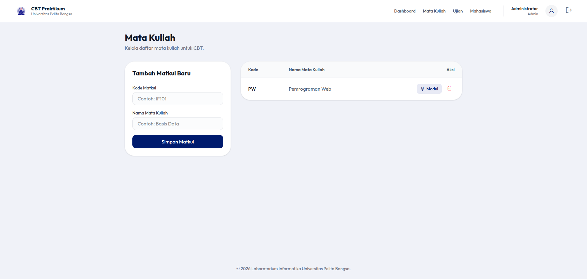

### Menambah Mata Kuliah Baru

1. Dari dashboard, klik **"Mata Kuliah"** di navigasi atas
2. Pada panel kiri **"Tambah Matkul Baru"**, isi:

| Field | Keterangan | Contoh |
|-------|------------|--------|
| **Kode Matkul** | Kode unik mata kuliah | `PW` |
| **Nama Mata Kuliah** | Nama lengkap mata kuliah | `Pemrograman Web` |

3. Klik **"Simpan Matkul"**
4. Notifikasi sukses akan muncul: *"Mata kuliah berhasil ditambahkan"*

### Mengelola Modul dan Menghapus Mata Kuliah

- **Modul** — Klik tombol `Modul` untuk masuk ke manajemen modul mata kuliah
- **Hapus** — Klik ikon tong sampah untuk menghapus mata kuliah
- Mata kuliah yang memiliki modul atau ujian **tidak dapat dihapus**

---

## 6. Manajemen Modul Praktikum

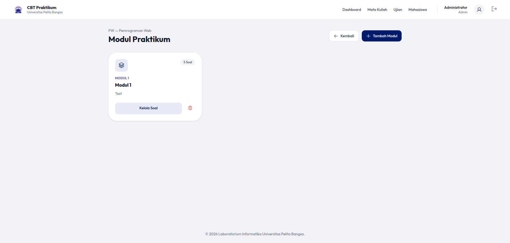

### Membuka Modul

1. Dari halaman **Mata Kuliah**, klik tombol **"Modul"** pada baris mata kuliah yang diinginkan
2. Halaman **"Modul Praktikum"** akan menampilkan daftar modul dalam bentuk kartu

### Menambah Modul Baru

1. Klik tombol **"Tambah Modul"** (kanan atas)
2. Isi form:

| Field | Keterangan | Contoh |
|-------|------------|--------|
| **Nomor Modul** | Nomor/nama singkat modul | `Modul 1` |
| **Nama Modul** | Nama lengkap modul | `Pengenalan HTML` |
| **Deskripsi** | Penjelasan modul | *(opsional)* |

3. Klik **"Simpan"**

### Tindakan per Modul

| Tombol | Fungsi |
|--------|--------|
| **Kelola Soal** | Masuk ke bank soal modul |
| **Hapus** | Hapus modul dan seluruh soalnya |

> Modul yang sudah digunakan oleh ujian **tidak dapat dihapus**.

---

## 7. Bank Soal


Bank soal menampilkan semua soal dalam sebuah modul. Dilengkapi dengan fitur pencarian, filter kategori, dan pagination.

### Melihat Soal

1. Dari halaman modul, klik **"Kelola Soal"**
2. Halaman bank soal menampilkan tabel soal dengan kolom:
   - **No** — Nomor urut
   - **Soal** — Teks pertanyaan + gambar *(jika ada)*
   - **Kategori** — Mudah / Sedang / Sulit
   - **Pembahasan** — Penjelasan jawaban *(jika ada)*
   - **Aksi** — Edit, Duplikasi, Hapus

### Menambah Soal Manual

1. Klik tombol **"Tambah Manual"** (kanan atas)
2. Isi form lengkap:

| Field | Keterangan | Wajib |
|-------|------------|-------|
| **Teks Pertanyaan** | Isi soal | ✅ |
| **Gambar** | Upload gambar pendukung soal | ❌ |
| **Kategori** | Mudah / Sedang / Sulit | ❌ |
| **Pembahasan** | Penjelasan jawaban | ❌ |
| **Opsi A** | Pilihan jawaban A | ✅ |
| **Opsi B** | Pilihan jawaban B | ✅ |
| **Opsi C** | Pilihan jawaban C | ✅ |
| **Opsi D** | Pilihan jawaban D | ✅ |
| **Kunci Jawaban** | Pilih radio button pada opsi yang benar | ✅ |

3. Klik **"Simpan"**

### Mengedit Soal

1. Klik ikon **edit** pada baris soal
2. Ubah data yang diperlukan
3. Klik **"Simpan Perubahan"**

### Menduplikasi Soal

- Klik ikon **duplikasi** untuk membuat salinan soal (termasuk gambar)

### Menghapus Soal

- Klik ikon **hapus** untuk menghapus soal

### Impor Soal (CSV & DOCX)

Tersedia dua metode impor di panel kiri halaman bank soal:

- **CSV** — Unggah file CSV + ZIP gambar (opsional)
- **DOCX** — Unggah file Word (.docx) dengan format terstruktur

> Detail lebih lanjut di bagian [Impor Data](#18-impor-data)

---

## 8. Manajemen Kelas

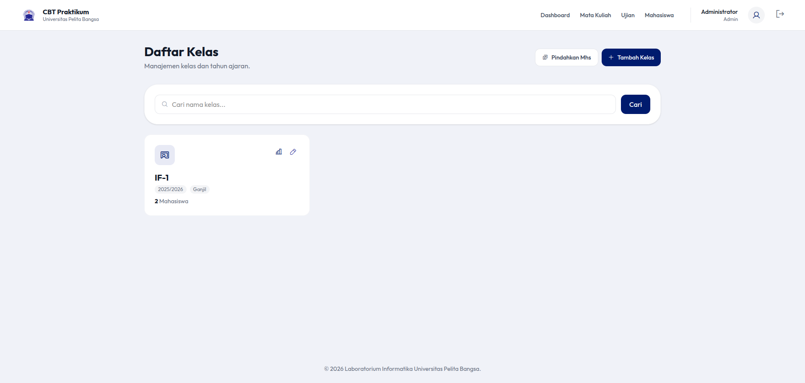

### Melihat Daftar Kelas

1. Klik **"Mahasiswa"** di navigasi atas, lalu tab/klik **"Kelas"** atau akses langsung:
   ```
   /admin/classrooms
   ```
2. Ditampilkan dalam bentuk kartu yang menampilkan:
   - Nama kelas
   - Tahun ajaran
   - Semester
   - Jumlah mahasiswa

### Menambah Kelas Baru

1. Klik tombol **"Tambah Kelas"**
2. Isi form modal:

| Field | Keterangan | Contoh |
|-------|------------|--------|
| **Nama Kelas** | Nama unik kelas | `IF-1` |
| **Tahun Ajaran** | Tahun akademik | `2025/2026` |
| **Semester** | Pilih Ganjil/Genap | `Ganjil` |

3. Klik **"Simpan"**

### Tindakan per Kelas

| Tombol | Fungsi |
|--------|--------|
| **Edit** | Ubah data kelas |
| **Rekap Nilai** | Lihat matriks nilai seluruh siswa *(lihat [Rekap Nilai](#13-rekap-nilai-per-kelas))* |
| **Pindahkan Mhs** | Pindahkan mahasiswa ke kelas lain |
| **Hapus** | Hapus kelas *(tidak bisa jika masih ada mahasiswa)* |

---

## 9. Manajemen Mahasiswa

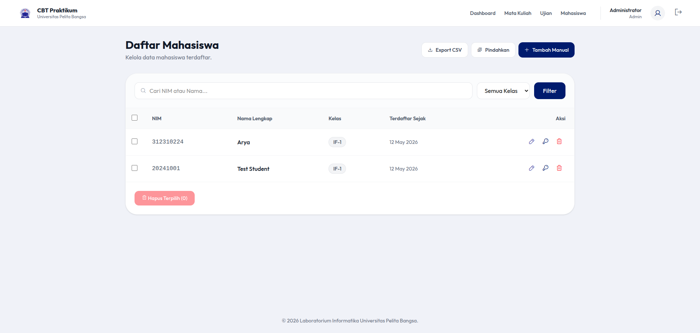

### Melihat Daftar Mahasiswa

1. Klik **"Mahasiswa"** di navigasi atas
2. Halaman **"Daftar Mahasiswa"** menampilkan tabel dengan:
   - NIM
   - Nama lengkap
   - Kelas
   - Tanggal registrasi
   - Aksi

### Pencarian dan Filter

- **Cari** — Ketik NIM atau nama mahasiswa
- **Filter Kelas** — Pilih kelas untuk menyaring mahasiswa

### Menambah Mahasiswa Manual

1. Klik tombol **"Tambah Mahasiswa"**
2. Isi form:

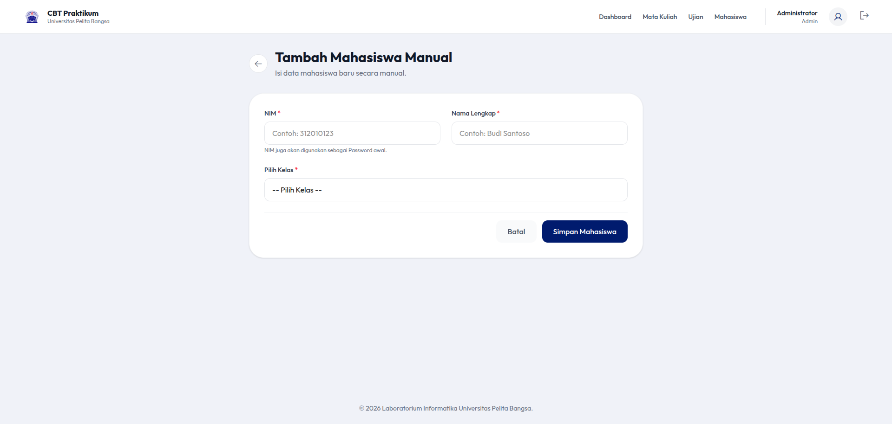

| Field | Keterangan | Wajib |
|-------|------------|-------|
| **NIM** | Nomor Induk Mahasiswa (unik) | ✅ |
| **Nama Lengkap** | Nama mahasiswa | ✅ |
| **Pilih Kelas** | Kelas tujuan | ✅ |

3. Klik **"Simpan Mahasiswa"**
4. Password awal = NIM

### Tindakan per Mahasiswa

| Tombol | Fungsi |
|--------|--------|
| **Edit** | Ubah data mahasiswa |
| **Reset Password** | Reset password menjadi NIM |
| **Hapus** | Hapus data mahasiswa |

### Impor Mahasiswa dari CSV

1. Di halaman dashboard, cari bagian **"Import Data Mahasiswa"**
2. Pilih file CSV dengan format: `NIM, Nama, Kelas`
3. Klik **"Import"**
4. Sistem akan otomatis membuat kelas baru jika belum ada

### Ekspor Mahasiswa ke CSV

- Klik tombol **"Export"** untuk mengunduh data mahasiswa dalam format CSV

### Pindahkan Mahasiswa Antar Kelas

1. Klik tombol **"Pindahkan Mhs"**
2. Pilih **kelas asal** dan **kelas tujuan**
3. Centang mahasiswa yang akan dipindahkan
4. Klik **"Pindahkan"**

---

## 10. Manajemen Ujian

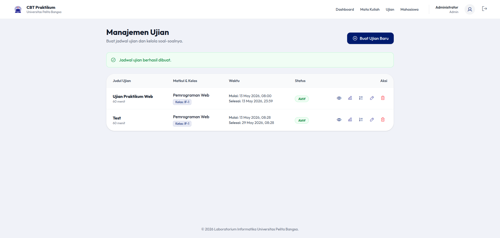

### Membuat Ujian Baru

1. Klik **"Ujian"** di navigasi atas
2. Klik tombol **"Buat Ujian Baru"**
3. Isi form lengkap:

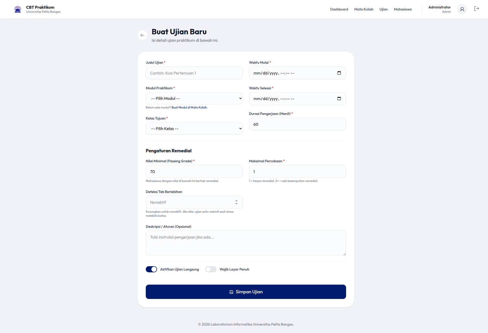

#### Informasi Dasar

| Field | Keterangan | Contoh |
|-------|------------|--------|
| **Judul Ujian** | Nama ujian | `Ujian Akhir Praktikum Web` |
| **Modul Praktikum** | Pilih modul (soal akan diambil dari sini) | `Modul 1 - PW` |
| **Kelas Tujuan** | Kelas yang akan mengikuti ujian | `IF-1` |

#### Waktu dan Durasi

| Field | Keterangan |
|-------|------------|
| **Waktu Mulai** | Tanggal dan jam dimulainya ujian |
| **Waktu Selesai** | Tanggal dan jam berakhirnya ujian |
| **Durasi Pengerjaan** | Durasi ujian dalam menit (default: 60) |

#### Penilaian dan Percobaan

| Field | Keterangan | Default |
|-------|------------|---------|
| **Passing Grade** | Nilai minimal kelulusan (0–100) | 70 |
| **Maksimal Percobaan** | Jumlah maksimal percobaan (1–10) | 1 |

> Jika `Maksimal Percobaan > 1`, mahasiswa yang belum lulus dapat mengulang **(remedial)**.

#### Fitur Keamanan

| Field | Keterangan |
|-------|------------|
| **Wajib Layar Penuh** | Mahasiswa harus dalam mode fullscreen selama ujian |
| **Deteksi Tab Berlebihan** | Jumlah maksimal pindah tab sebelum ujian otomatis dikunci (kosongkan = nonaktif) |

#### Lainnya

| Field | Keterangan |
|-------|------------|
| **Deskripsi** | Instruksi atau peraturan ujian *(opsional)* |
| **Aktifkan Ujian** | Centang untuk mengaktifkan ujian |

4. Klik **"Simpan Ujian"**

### Melihat Detail Ujian

1. Klik judul ujian pada daftar
2. Halaman detail menampilkan:
   - Informasi ujian (sidebar)
   - Informasi modul (soal terkait)
   - **Preview Soal** — Semua soal ditampilkan dengan kunci jawaban

### Mengedit Ujian

1. Klik ikon **edit** pada baris ujian
2. Ubah data yang diperlukan
3. Klik **"Simpan Perubahan"**

### Menghapus Ujian

- Klik ikon **hapus** — ujian hanya bisa dihapus jika **belum ada mahasiswa yang menyelesaikan**

### Status Ujian

| Status | Indikator | Keterangan |
|--------|-----------|------------|
| **Aktif** | Badge hijau | Ujian dapat diakses mahasiswa |
| **Tidak Aktif** | Badge merah | Ujian disembunyikan dari mahasiswa |

---

## 11. Monitoring Ujian

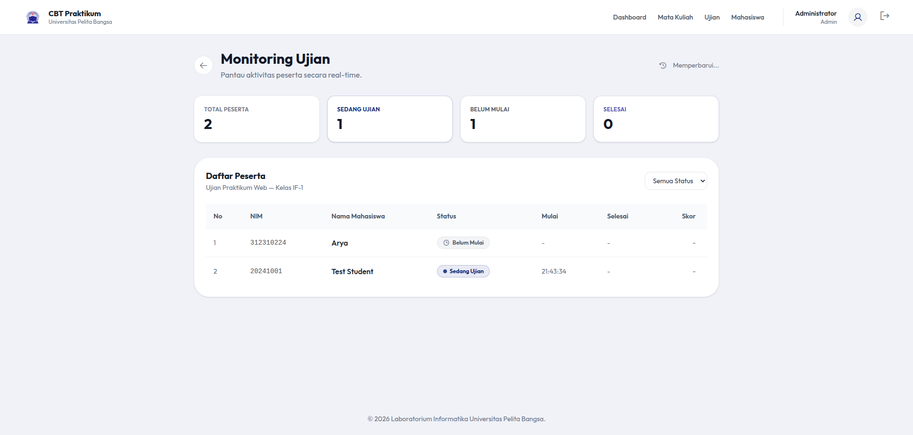

Halaman monitoring menampilkan status peserta secara real-time.

### Akses Halaman Monitor

1. Dari daftar ujian, klik ikon **monitor** (layar) pada baris ujian
2. Atau dari halaman detail ujian, klik **"Monitor"**

### Statistik Peserta

| Kartu | Keterangan |
|-------|------------|
| **Total** | Jumlah seluruh peserta |
| **Sedang Mengerjakan** | Peserta yang sedang ujian |
| **Belum Mulai** | Peserta yang belum memulai |
| **Selesai** | Peserta yang sudah selesai |

### Daftar Peserta

Tabel peserta menampilkan:
- NIM dan Nama
- Status (Belum Mulai / Sedang Mengerjakan / Selesai)
- Waktu mulai
- Waktu selesai
- Skor (jika sudah selesai)
- Jumlah percobaan
- Jumlah pindah tab

### Filter Status

Pilih filter untuk menampilkan peserta berdasarkan status:
- **Semua**
- **Belum Mulai**
- **Sedang Mengerjakan**
- **Selesai**

> Halaman monitor melakukan **auto-refresh setiap 10 detik** untuk data terbaru.

---

## 12. Hasil dan Laporan

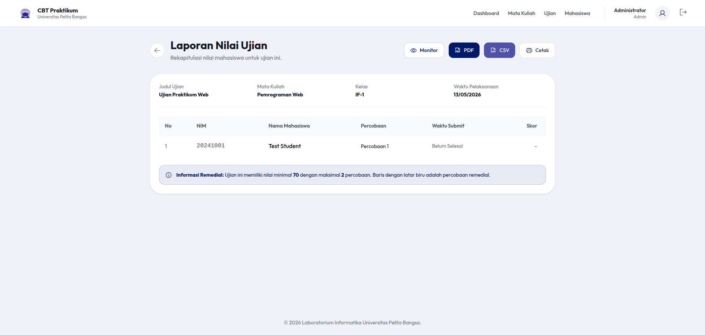

### Melihat Hasil Ujian

1. Dari daftar ujian, klik ikon **"Lihat Nilai"** (dokumen) pada baris ujian
2. Halaman hasil menampilkan tabel:

| Kolom | Keterangan |
|-------|------------|
| **No** | Nomor urut |
| **NIM** | NIM mahasiswa |
| **Nama Mahasiswa** | Nama lengkap |
| **Percobaan** | Percobaan ke- |
| **Waktu Submit** | Waktu pengumpulan |
| **Skor** | Nilai akhir |
| **Status** | LULUS / GAGAL / REMEDIAL |

### Tindakan

| Tombol | Fungsi |
|--------|--------|
| **Cetak** | Cetak halaman hasil |
| **PDF** | Download laporan PDF *(lihat [PDF Laporan](#14-pdf-laporan-dan-ekspor-data))* |
| **CSV** | Ekspor hasil ke CSV |
| **Nama Mahasiswa** | Lihat laporan detail per mahasiswa |

### Laporan Detail per Mahasiswa

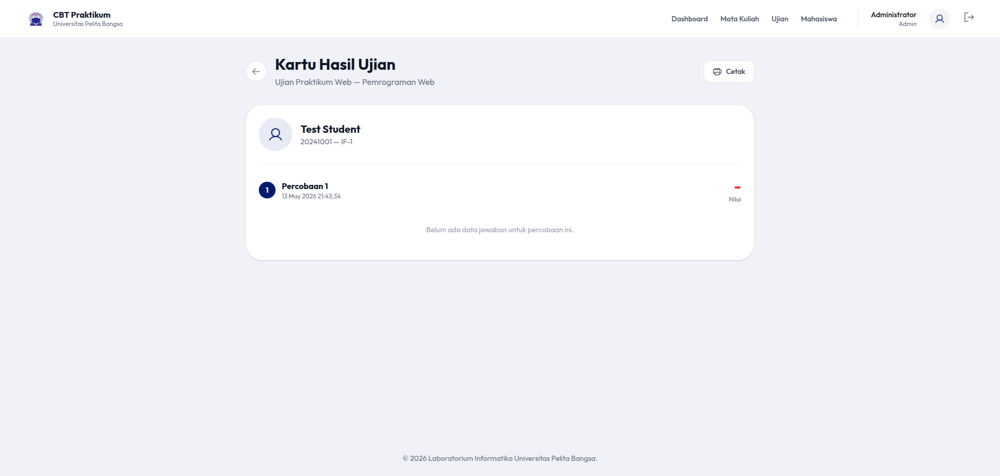

1. Klik **nama mahasiswa** pada tabel hasil
2. Halaman menampilkan untuk setiap percobaan:
   - Skor dan status (lulus/gagal)
   - Rincian per soal: jawaban mahasiswa vs kunci jawaban
   - Tanda ❌ untuk jawaban salah, ✅ untuk jawaban benar

---

## 13. Rekap Nilai per Kelas

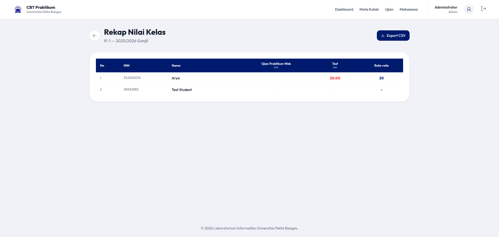

Fitur rekap nilai menampilkan matriks nilai seluruh mahasiswa dalam satu kelas di semua ujian.

### Akses Rekap Nilai

1. Buka halaman **"Kelas"**
2. Klik tombol **"Rekap Nilai"** pada kartu kelas
3. Halaman menampilkan tabel matriks:
   - **Baris** — Nama mahasiswa
   - **Kolom** — Judul ujian
   - **Sel** — Nilai mahasiswa per ujian (kosong = belum mengerjakan)
   - **Kolom terakhir** — Rata-rata nilai mahasiswa

### Ekspor Rekap ke CSV

- Klik tombol **"Export CSV"** untuk mengunduh rekap nilai dalam format CSV

---

## 14. PDF Laporan dan Ekspor Data

### PDF Laporan Nilai per Ujian

Laporan PDF dihasilkan dengan format resmi:
- **Kop surat** — Logo UPB + identitas laboratorium (double-line border)
- **Ringkasan** — Jumlah peserta, rata-rata, nilai tertinggi, nilai terendah, lulus, gagal
- **Tabel Nilai** — Daftar peserta dengan NIM, nama, skor, status
- **Tanda Tangan** — Ruang tanda tangan pengawas dan ketua laboratorium
- **Footer** — Tanggal generasi laporan

### Cara Ekspor

| Ekspor | Lokasi | Format |
|--------|--------|--------|
| **Hasil Ujian (PDF)** | Halaman hasil ujian → tombol PDF | PDF (dompdf) |
| **Hasil Ujian (CSV)** | Halaman hasil ujian → tombol CSV | CSV (.csv) |
| **Rekap Kelas (CSV)** | Halaman rekap kelas → tombol Export CSV | CSV (.csv) |
| **Data Mahasiswa (CSV)** | Halaman mahasiswa → tombol Export | CSV (.csv) |

---

## 15. Sisi Mahasiswa

### Dashboard Mahasiswa

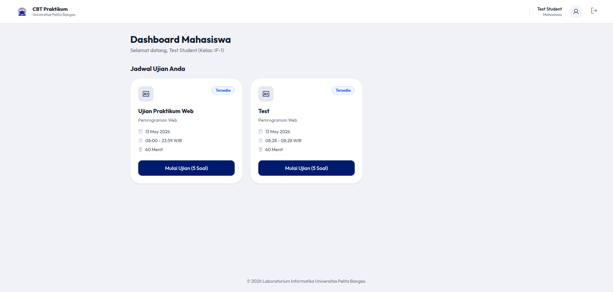

Setelah login, mahasiswa melihat **Dashboard Mahasiswa** dengan daftar ujian yang tersedia.

#### Status Ujian

| Status | Warna | Keterangan |
|--------|-------|------------|
| **Selesai** | Hijau | Ujian sudah dikerjakan dan selesai |
| **Remedial** | Amber | Nilai di bawah passing grade, bisa mengulang |
| **Sedang Dikerjakan** | Biru | Ujian sedang berlangsung (ada sesi aktif) |
| **Belum Mulai** | Abu-abu | Ujian belum waktunya |
| **Tersedia** | Biru | Ujian siap dikerjakan |

#### Informasi per Kartu Ujian
- Judul ujian
- Mata kuliah
- Tanggal dan waktu
- Durasi
- Jumlah soal
- Status badge

### Persiapan Ujian

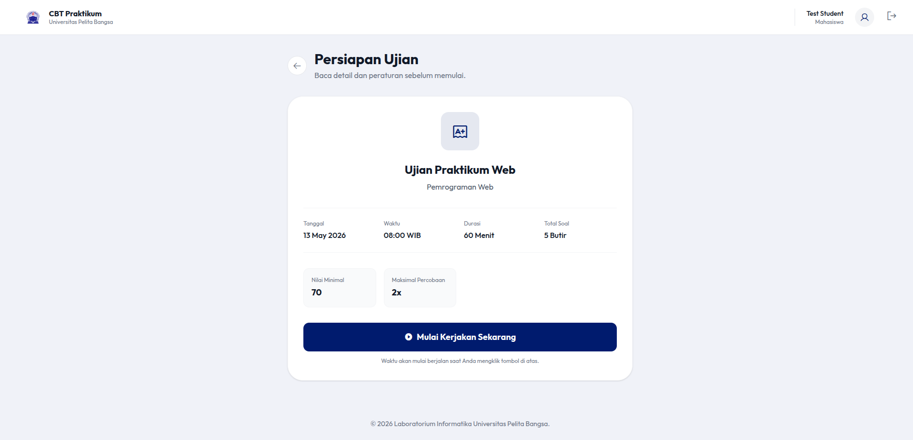

1. Klik kartu ujian untuk masuk ke halaman persiapan
2. Halaman menampilkan:
   - Informasi detail (tanggal, waktu, durasi, jumlah soal)
   - Nilai minimal (passing grade)
   - Maksimal percobaan
   - Indikator deteksi tab *(jika diaktifkan)*
   - Indikator fullscreen *(jika diwajibkan)*
   - Instruksi/peraturan ujian
3. Klik **"Mulai Kerjakan Sekarang"** untuk memulai

> Jika ujian mewajibkan **layar penuh**, tombol akan aktif setelah masuk mode layar penuh.

---

## 16. Mengerjakan Ujian


Halaman ujian adalah halaman utama untuk mengerjakan soal.

### Layout Halaman

#### Header (fixed, z-50)
- Logo + judul ujian
- Nama mahasiswa
- **Countdown timer** — Hitung mundur sisa waktu

#### Area Soal (scrollable)
- Soal ditampilkan satu per satu (nomor, teks, gambar, 4 opsi radio button)
- Navigasi **"Sebelumnya"** dan **"Selanjutnya"**

#### Sidebar Navigasi
- Tombol nomor soal (1, 2, 3, ...)
- **Warna tombol**:
  - 🔵 **Biru (primary)** — Sudah dijawab
  - 🟡 **Amber** — Belum dikirim ke server (pending)
  - ⚪ **Putih** — Belum dijawab

### Sistem Auto-Save

Jawaban mahasiswa secara otomatis tersimpan setiap kali memilih opsi:

1. Mahasiswa mengklik radio button
2. AJAX request dikirim ke server (`/student/exams/{id}/save-answer`)
3. Jawaban tersimpan di database (`Answer::updateOrCreate`)
4. Tombol navigasi berubah warna menjadi biru (terjawab)

> Jika koneksi terputus, jawaban disimpan di **localStorage** dan akan dikirim saat koneksi kembali (setiap 15 detik).

### Navigasi Soal

| Tombol | Fungsi |
|--------|--------|
| **◀ Sebelumnya** | Soal sebelumnya |
| **▶ Selanjutnya** | Soal selanjutnya |
| **Nomor soal (sidebar)** | Langsung ke soal tertentu |
| **Akhiri Ujian** | Buka modal konfirmasi submit |

### Submit Ujian

1. Klik **"Akhiri Ujian"**
2. Modal konfirmasi muncul:
   - Jumlah soal yang sudah dijawab
   - Jumlah total soal
   - Peringatan jika masih ada soal belum dijawab
   - Tombol **"Ya, Kumpulkan"** atau **"Kembali"**
3. Setelah submit, sistem menghitung skor dari database
4. Redirect ke dashboard dengan notifikasi hasil

### Auto-submit

Sistem akan otomatis mengumpulkan ujian jika:
| Kondisi | Pesan |
|---------|-------|
| **Waktu habis** | "Waktu habis, ujian otomatis diselesaikan" |
| **Terlalu banyak pindah tab** | "Terlalu banyak pindah tab, ujian otomatis diselesaikan" |

---

## 17. Fitur Keamanan Ujian

### Deteksi Pindah Tab

1. Admin mengaktifkan **"Deteksi Tab Berlebihan"** saat membuat ujian
2. Tentukan batas maksimal pindah tab (misal: 3 kali)
3. Setiap kali mahasiswa meninggalkan tab ujian (`visibilitychange`), sistem mencatatnya
4. Jika batas terlampaui → **ujian otomatis dikumpulkan**

> Hanya `visibilitychange` yang dideteksi (bukan `blur`), sehingga menghindari false positive dari klik address bar atau devtools.

### Fullscreen Wajib

1. Admin mengaktifkan **"Wajib Layar Penuh"** saat membuat ujian
2. Halaman persiapan menampilkan tombol **"Masuk Layar Penuh"**
3. Tombol **"Mulai Kerjakan"** baru aktif setelah fullscreen aktif
4. Selama ujian, halaman ditutup overlay jika keluar dari fullscreen
5. Setiap keluar dari fullscreen dihitung sebagai pindah tab
6. Mahasiswa hanya perlu klik **"Masuk Layar Penuh"** untuk kembali (tanpa refresh)

### Proteksi Lainnya

| Proteksi | Mekanisme |
|----------|-----------|
| **Race condition start** | DB transaction + row lock mencegah start ganda |
| **Source of truth scoring** | Skor dihitung dari database, bukan dari form POST |
| **Pengacakan deterministik** | Urutan soal & opsi ditentukan oleh hash (user+exam+attempt) |
| **Validasi akses** | Setiap endpoint memeriksa kelas, status aktif, dan waktu |
| **Perlindungan hapus** | Cascade delete dilindungi FK (nullOnDelete, restrictOnDelete) |
| **Sanitasi CSV** | Mencegah formula injection (`=+-@` → `'`) |
| **Path traversal** | Ekstraksi ZIP dengan validasi `realpath()` |
| **Rate limit login** | 5 percobaan per menit per IP |

---

## 18. Impor Data

### Impor Mahasiswa (CSV)

**Format CSV:**
```csv
NIM,Nama,Kelas
312010001,Budi Santoso,TI.22.A.1
312010002,Ani Wijaya,TI.22.A.1
```

| Kolom | Keterangan |
|-------|------------|
| **NIM** | Nomor Induk Mahasiswa (unik) |
| **Nama** | Nama lengkap |
| **Kelas** | Nama kelas (otomatis dibuat jika belum ada) |

### Impor Soal (CSV)

**Download template:** Dari halaman bank soal, klik **"Template CSV"**

**Format CSV (8 kolom):**
```csv
Soal,Gambar,Pilihan A,Pilihan B,Pilihan C,Pilihan D,Kunci,Kategori
"Siapa presiden pertama RI?",,Soekarno,Soeharto,Habibie,Gus Dur,A,mudah
```

| Kolom | Keterangan |
|-------|------------|
| **Soal** | Teks pertanyaan |
| **Gambar** | Nama file gambar (letakkan di ZIP) |
| **Pilihan A–D** | Opsi jawaban |
| **Kunci** | A, B, C, atau D |
| **Kategori** | mudah / sedang / sulit *(opsional)* |

**Import dengan ZIP:**
1. Siapkan file CSV + folder gambar, kompres ke ZIP
2. Unggah ZIP melalui form impor
3. Gambar otomatis diekstrak dan ditautkan ke soal

### Impor Soal (DOCX)

**Download template:** Dari halaman bank soal, klik **"Template Word"**

**Format DOCX:**
```
Soal 1
Siapa presiden pertama RI?
A. Soekarno
B. Soeharto
C. Habibie
D. Gus Dur
Kunci: A
Kategori: mudah
Pembahasan: Soekarno adalah presiden pertama RI

Soal 2
...
```

| Elemen | Keterangan |
|--------|------------|
| **Soal N** | Nomor soal + teks pertanyaan |
| **A–D** | Opsi jawaban (wajib) |
| **Kunci:** | Jawaban benar (A/B/C/D) |
| **Kategori:** | mudah/sedang/sulit *(opsional)* |
| **Pembahasan:** | Penjelasan jawaban *(opsional)* |

> Gambar dalam DOCX (inline) akan otomatis diekstrak.

---

## 19. Panduan Singkat (Quick Start)

### Skenario Lengkap: Dari Setup hingga Ujian

#### Langkah 1 — Setup Data Master

| Urutan | Tindakan | Menu |
|--------|----------|------|
| 1 | Tambah **Mata Kuliah** | Mata Kuliah → Tambah Matkul Baru |
| 2 | Tambah **Modul** dalam mata kuliah | Mata Kuliah → Modul → Tambah Modul |
| 3 | Tambah **Soal** ke modul | Modul → Kelola Soal → Tambah Manual |
| 4 | Tambah **Kelas** | Mahasiswa → Kelola Kelas → Tambah Kelas |
| 5 | Tambah **Mahasiswa** ke kelas | Mahasiswa → Tambah Mahasiswa |

#### Langkah 2 — Buat dan Jadwalkan Ujian

| Urutan | Tindakan |
|--------|----------|
| 1 | Ujian → Buat Ujian Baru |
| 2 | Isi judul, pilih modul, pilih kelas |
| 3 | Atur waktu mulai, selesai, durasi |
| 4 | Atur passing grade dan maksimal percobaan |
| 5 | Atur fitur keamanan (fullscreen, deteksi tab) |
| 6 | Simpan |

#### Langkah 3 — Pelaksanaan Ujian

| Siapa | Tindakan |
|-------|----------|
| **Admin** | Buka Monitor untuk memantau peserta |
| **Mahasiswa** | Login → Dashboard → Klik ujian → Mulai Kerjakan |
| **Mahasiswa** | Jawab soal → Auto-save → Submit |

#### Langkah 4 — Evaluasi

| Urutan | Tindakan |
|--------|----------|
| 1 | Lihat **Hasil Ujian** — tabel peringkat |
| 2 | Lihat **Laporan Mahasiswa** — detail jawaban per soal |
| 3 | Download **PDF** atau **CSV** hasil ujian |
| 4 | Lihat **Rekap Kelas** — matriks nilai semua ujian |

---

## 20. Pemecahan Masalah

### Masalah Login

| Masalah | Solusi |
|---------|--------|
| **"Too Many Requests" (429)** | Tunggu 1 menit, batasi percobaan login |
| **Lupa password admin** | Reset via database: `php artisan tinker` → update password |
| **Lupa password mahasiswa** | Admin dapat reset password dari halaman mahasiswa (reset ke NIM) |

### Masalah Ujian

| Masalah | Solusi |
|---------|--------|
| **Ujian tidak muncul di dashboard mahasiswa** | Periksa: kelas tujuan, status aktif, waktu mulai |
| **Tombol mulai tidak aktif** | Jika fullscreen wajib, masuk layar penuh dulu |
| **Tidak bisa klik "Mulai"** | Periksa koneksi, reload halaman |
| **Auto-save gagal** | Cek koneksi internet; jawaban disimpan di localStorage |

### Masalah Impor

| Masalah | Solusi |
|---------|--------|
| **CSV error** | Pastikan format CSV benar (koma sebagai pemisah, UTF-8) |
| **ZIP error** | Pastikan struktur ZIP: CSV di root, gambar di root |
| **DOCX error** | Pastikan format sesuai template; gunakan template resmi |

### Masalah Lain

| Masalah | Solusi |
|---------|--------|
| **Halaman error 500** | Jalankan `php artisan optimize:clear` |
| **Gambar tidak muncul** | Jalankan `php artisan storage:link` |
| **Session expired** | Login ulang; session diatur dalam konfigurasi Laravel |
| **PDF tidak muncul** | Pastikan `barryvdh/laravel-dompdf` terinstall |

---

> **© 2026 Laboratorium Informatika Universitas Pelita Bangsa**
>
> Dokumentasi ini dapat diperbarui sesuai dengan perkembangan aplikasi.
