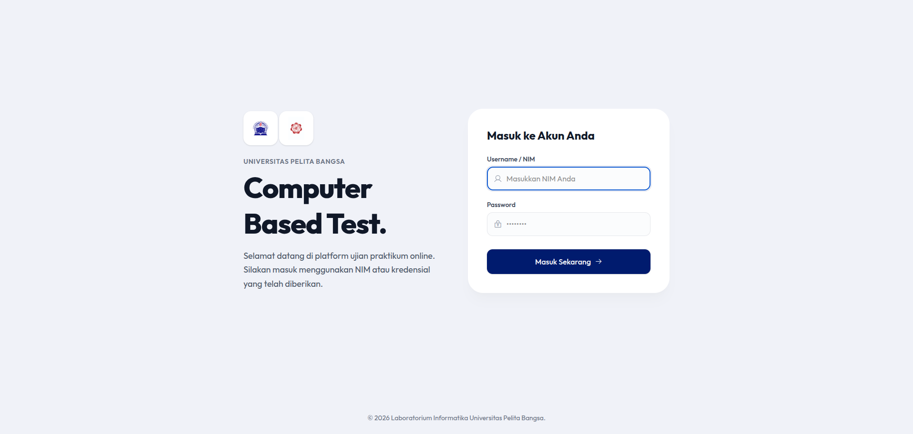
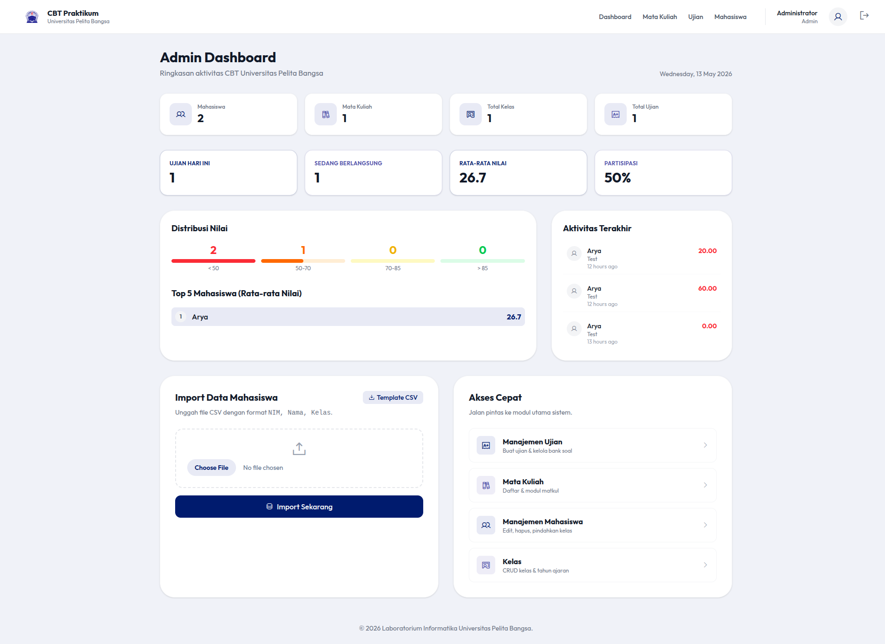
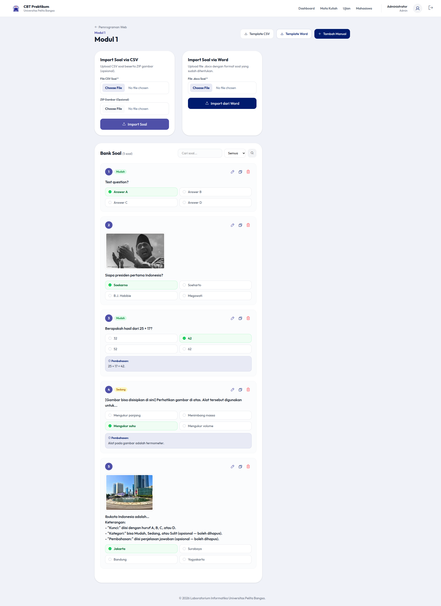
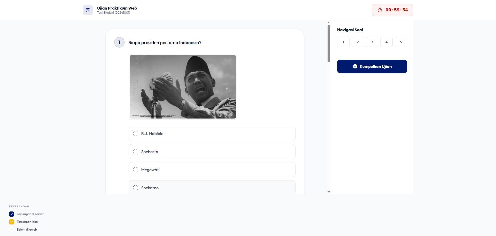

# CBT Praktikum

**Computer Based Testing (CBT)** — Platform ujian praktikum online untuk **Laboratorium Informatika Universitas Pelita Bangsa**.

[](https://laravel.com)
[](https://php.net)
[](https://tailwindcss.com)
[](https://mysql.com)

---

## Fitur

### Manajemen Akademik
- **Mata Kuliah** — CRUD mata kuliah
- **Modul Praktikum** — CRUD modul per mata kuliah
- **Bank Soal** — Buat, edit, duplikasi, hapus soal + gambar + pembahasan
- **Kelas** — CRUD kelas dengan tahun ajaran dan semester
- **Mahasiswa** — CRUD, impor CSV, ekspor CSV, pindah kelas, reset password

### Ujian
- **Jadwal Ujian** — Atur waktu, durasi, kelas, modul, passing grade, percobaan
- **Sistem Remedial** — Mahasiswa dapat mengulang jika nilai di bawah passing grade
- **Deteksi Tab** — Batasi jumlah pindah tab/buffer, auto-submit jika melebihi batas
- **Fullscreen Wajib** — Wajibkan mode layar penuh selama ujian
- **Auto-save Jawaban** — Simpan jawaban via AJAX setiap klik opsi
- **Offline Queue** — Jawaban disimpan di localStorage saat offline, sinkron otomatis

### Monitoring & Laporan
- **Monitoring Real-time** — Pantau status peserta (auto-refresh 10 detik)
- **Hasil Ujian** — Tabel nilai lengkap dengan status lulus/gagal/remedial
- **PDF Laporan** — Ekspor hasil ke PDF dengan kop surat resmi UPB
- **CSV Ekspor** — Hasil ujian, rekap kelas, data mahasiswa
- **Rekap Nilai per Kelas** — Matriks nilai semua ujian dalam satu kelas
- **Laporan per Mahasiswa** — Detail jawaban per soal per percobaan

### Impor Data
| Jenis | Format | Detail |
|-------|--------|--------|
| Mahasiswa | CSV | Auto-create kelas, skip duplikat |
| Soal | CSV + ZIP | 8 kolom, dukungan gambar via ZIP |
| Soal | DOCX | Format terstruktur, ekstrak gambar inline |

---

## Screenshot

| Halaman | Tampilan |
|---------|----------|
| Login |  |
| Dashboard Admin |  |
| Manajemen Soal |  |
| Halaman Ujian |  |

> Lihat semua screenshot di folder [`screenshots/`](screenshots/)

---

## Instalasi

### Prasyarat
- PHP 8.2+
- MySQL 8.0+
- Composer
- Node.js & NPM

### Langkah Instalasi

```bash
# 1. Clone repository
git clone https://github.com/AryaWiratama26/new-cbt-labinformatika
cd new-cbt

# 2. Install dependencies
composer install
npm install

# 3. Konfigurasi environment
cp .env.example .env
php artisan key:generate

# 4. Atur database di .env
DB_DATABASE=new_cbt
DB_USERNAME=root
DB_PASSWORD=

# 5. Migrasi dan seed
php artisan migrate:fresh --seed

# 6. Storage link
php artisan storage:link

# 7. Build assets
npm run build

# 8. Jalankan server
php artisan serve
```

Akses: `http://localhost:8000`

### Login Default

| Role | Username | Password |
|------|----------|----------|
| Admin | `admin` | `admin` |
| Mahasiswa | `20241001` | `test123` |

---

## Dokumentasi

**[PENGGUNAAN.MD](PENGGUNAAN.MD)** — Panduan penggunaan lengkap dari awal hingga akhir (876 baris, 17 screenshot)

### Cakupan Dokumentasi
1. Login (admin & mahasiswa)
2. Dashboard admin + statistik
3. Manajemen mata kuliah, modul, bank soal
4. Manajemen kelas & mahasiswa
5. Jadwal ujian (dengan fitur keamanan)
6. Monitoring real-time
7. Hasil, PDF, CSV, rekap nilai
8. Sisi mahasiswa (ujian, auto-save, submit)
9. Fitur keamanan (deteksi tab, fullscreen)
10. Impor data (CSV, DOCX, ZIP)
11. Quick start skenario lengkap
12. Pemecahan masalah

---

## Testing

### Playwright E2E Tests

```bash
# Setup
cd tests/e2e
npm install

# Jalankan server (di terminal terpisah)
php artisan serve

# Jalankan test
npx playwright test --config=tests/e2e/playwright.config.ts

# Lihat report
npx playwright show-report tests/e2e/playwright-report
```

> Perhatikan: Global setup menjalankan `migrate:fresh` yang akan menghapus semua data.

---

## Tech Stack

| Teknologi | Penggunaan |
|-----------|------------|
| **Laravel 12** | Backend framework |
| **MySQL** | Database |
| **Tailwind CSS 4** | Styling |
| **Phosphor Icons** | Icon set |
| **Vite** | Asset bundler |
| **barryvdh/laravel-dompdf** | PDF generation |
| **PhpOffice/PhpWord** | DOCX generation & parsing |
| **Playwright** | E2E testing |

---

## Pengembang

Dikembangkan oleh **Laboratorium Informatika** — **Universitas Pelita Bangsa**.
- Arya Wiratama
- Farel Aryaduta Daniswara

---

## Lisensi

Hak cipta © 2026 Laboratorium Informatika Universitas Pelita Bangsa.
